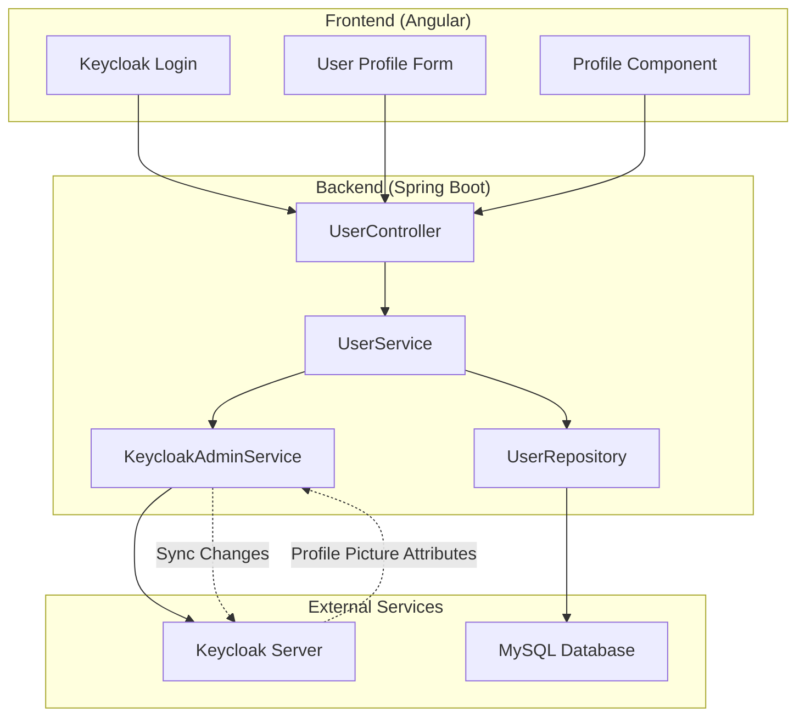

# Hotel Management System - Bidirectional Keycloak-Database Synchronization

## 📋 Overview

This document explains the complete bidirectional synchronization system between Keycloak and the database for user profiles, including profile pictures.

## 🔄 Synchronization Flow

### 1. Keycloak → Database Sync (User Login/Registration)

**When:** User logs in or registers through Keycloak
**What happens:**
```
Keycloak JWT Token → Extract User Profile → Sync to Database → Update/Create User
```

**Code Flow:**
```java
// 1. User logs in via Angular/Keycloak
// 2. JWT token contains user profile data
// 3. Frontend calls backend with user data
// 4. Backend processes sync:

@PostMapping("/sync")
public ResponseEntity<User> syncFromKeycloak(@Valid @RequestBody UserDto userDto) {
    User syncedUser = this.userService.syncFromKeycloak(userDto);
    return ResponseEntity.status(HttpStatus.OK).body(syncedUser);
}
```

**UserService.syncFromKeycloak() Process:**
```java
public User syncFromKeycloak(UserDto keycloakData) {
    // 1. Check if user exists in database
    User existingUser = findByUserName(keycloakData.getUserName());
    
    if (existingUser != null) {
        // 2a. Update existing user with Keycloak data
        // 2b. Retrieve profile picture from Keycloak if missing
        UserUpdateDto updateDto = userMapper.userDtoToUserUpdateDto(keycloakData);
        return updateById(existingUser.getId(), updateDto);
    } else {
        // 3a. Create new user
        // 3b. Retrieve profile picture from Keycloak if missing
        return save(keycloakData);
    }
}
```

### 2. Database → Keycloak Sync (Profile Updates)

**When:** User updates their profile in the application
**What happens:**
```
Angular Form → Backend API → Update Database → Sync to Keycloak
```

**Code Flow:**
```java
// 1. User updates profile via Angular form
// 2. Angular calls updateUserByUsername API
// 3. Backend processes update:

@PutMapping("/username/{username}")
public ResponseEntity<User> updateUserByUsername(@PathVariable("username") String username, 
                                               @Valid @RequestBody UserUpdateDto userUpdateDto) {
    User existingUser = this.userService.findByUserName(username);
    User updatedUser = this.userService.updateById(existingUser.getId(), userUpdateDto);
    return ResponseEntity.status(HttpStatus.OK).body(updatedUser);
}
```

**UserService.updateById() Process:**
```java
public User updateById(Long id, UserUpdateDto userUpdateDto) {
    // 1. Find user in database
    User user = this.userRepository.findById(id)
            .orElseThrow(() -> new GlobalException("user with ID " + id + " not found"));
    
    // 2. Store original values for change detection
    String originalFirstName = user.getFirstName();
    String originalLastName = user.getLastName();
    String originalProfileImage = user.getProfileImage();
    
    // 3. Update database
    this.userMapper.updateUserUpdateDtoToUser(userUpdateDto, user);
    User updatedUser = this.userRepository.save(user);
    
    // 4. Detect changes
    boolean nameChanged = /* check if first/last name changed */;
    boolean profileImageChanged = /* check if profile image changed */;
    
    // 5. Sync to Keycloak based on what changed
    if (nameChanged && profileImageChanged) {
        // Update everything
        keycloakAdminService.updateUserCompleteProfile(
            updatedUser.getUserName(),
            updatedUser.getFirstName(),
            updatedUser.getLastName(),
            updatedUser.getProfileImage()
        );
    } else if (nameChanged) {
        // Update only name
        keycloakAdminService.updateUserProfile(
            updatedUser.getUserName(),
            updatedUser.getFirstName(),
            updatedUser.getLastName()
        );
    } else if (profileImageChanged) {
        // Update only profile picture
        keycloakAdminService.updateUserProfilePicture(
            updatedUser.getUserName(),
            updatedUser.getProfileImage()
        );
    }
    
    return updatedUser;
}
```

## 🖼️ Profile Image Handling

### Storage Method
- **Database:** Base64 encoded string in `users.profile_image` column
- **Keycloak:** Base64 encoded string in user attributes as `profilePicture`

### Sync Process

**Upload New Image:**
```typescript
// Angular Frontend
onFileSelected(event: any) {
    const file = event.target.files[0];
    if (file) {
        const reader = new FileReader();
        reader.readAsDataURL(file); // Converts to base64
        reader.onload = () => {
            this.selectedImage = reader.result;
            this.profileForm.patchValue({ profileImage: this.selectedImage });
            this.profile.profileImage = this.selectedImage as string;
        }
    }
}
```

**Backend Processing:**
```java
// KeycloakAdminService.updateUserCompleteProfile()
public boolean updateUserCompleteProfile(String username, String firstName, String lastName, String profilePicture) {
    // 1. Find user in Keycloak
    List<UserRepresentation> users = usersResource.search(username, true);
    UserRepresentation user = users.get(0);
    
    // 2. Update basic info
    user.setFirstName(firstName);
    user.setLastName(lastName);
    
    // 3. Update profile picture in user attributes
    if (profilePicture != null && !profilePicture.isEmpty()) {
        if (user.getAttributes() == null) {
            user.setAttributes(new java.util.HashMap<>());
        }
        user.getAttributes().put("profilePicture", List.of(profilePicture));
    }
    
    // 4. Save to Keycloak
    UserResource userResource = usersResource.get(userId);
    userResource.update(user);
    
    return true;
}
```

## ⚙️ Configuration

### 1. Backend Configuration (application.properties)
```properties
# Keycloak Admin Configuration for bidirectional sync
keycloak.admin.server-url=http://localhost:8080
keycloak.admin.realm=master
keycloak.admin.client-id=admin-cli
keycloak.admin.username=admin
keycloak.admin.password=admin
keycloak.admin.target-realm=hotelrealm
```

### 2. Maven Dependencies (pom.xml)
```xml
<!-- Keycloak Admin Client for bidirectional sync -->
<dependency>
    <groupId>org.keycloak</groupId>
    <artifactId>keycloak-admin-client</artifactId>
    <version>25.0.0</version>
</dependency>
```

### 3. Database Schema
```sql
-- Users table with profile image support
CREATE TABLE users (
    id BIGINT AUTO_INCREMENT PRIMARY KEY,
    user_name VARCHAR(255) UNIQUE NOT NULL,
    email VARCHAR(255),
    first_name VARCHAR(255),
    last_name VARCHAR(255),
    role ENUM('USER', 'ADMIN'),
    profile_image LONGTEXT  -- Base64 encoded image
);
```

## 🔄 Data Flow Architecture



## 🚦 Change Detection Logic

The system intelligently detects what changed and syncs only the necessary data:

### Detection Matrix
| Change Type | Database Update | Keycloak Sync Method |
|-------------|----------------|---------------------|
| First Name Only | ✅ | `updateUserProfile()` |
| Last Name Only | ✅ | `updateUserProfile()` |
| Profile Image Only | ✅ | `updateUserProfilePicture()` |
| Name + Image | ✅ | `updateUserCompleteProfile()` |
| No Changes | ❌ | None |

## 🛡️ Error Handling

### Graceful Degradation
- Database updates always succeed even if Keycloak sync fails
- Keycloak connection errors are logged but don't break user experience
- Missing profile pictures don't prevent user operations

### Logging System
```java
// Success logs
System.out.println("✅ Successfully synced user profile changes to Keycloak for user: " + username);

// Warning logs  
System.err.println("⚠️ Failed to retrieve profile picture from Keycloak: " + e.getMessage());

// Error logs
System.err.println("❌ Failed to sync user profile changes to Keycloak for user: " + username);
```

## 🧪 Testing the System

### 1. Test Profile Picture Upload
1. Login to application
2. Open profile dialog
3. Select new image file
4. Submit form
5. Check backend logs for sync confirmation
6. Verify in Keycloak admin console

### 2. Test Name Changes
1. Update first name or last name
2. Submit form
3. Check logs for Keycloak sync
4. Verify changes in Keycloak admin console

### 3. Test Initial Login Sync
1. Login with new user
2. Check if user created in database
3. Verify profile picture retrieved from Keycloak (if exists)

## 📊 API Endpoints

### User Management
- `POST /api/users/sync` - Sync user from Keycloak to database
- `PUT /api/users/username/{username}` - Update user by username (triggers Keycloak sync)
- `GET /api/users/username/{username}` - Get user by username
- `GET /api/users/email/{email}` - Get user by email

### Profile Operations
- Frontend: Profile dialog component with image upload
- Backend: Automatic bidirectional sync on any profile change

## 🔧 Troubleshooting

### Common Issues

1. **Profile Image Not Syncing**
   - Check if `KeycloakAdminService` is properly configured
   - Verify Keycloak admin credentials
   - Check logs for sync errors

2. **User Not Found in Keycloak**
   - Ensure username matches exactly between systems
   - Check Keycloak realm configuration

3. **Database Update Fails**
   - Check MySQL connection
   - Verify user exists before update
   - Check field validation

### Debug Tips
- Enable detailed logging in `UserService` and `KeycloakAdminService`
- Monitor Keycloak admin console for attribute changes
- Check browser network tab for API call responses

This completes the bidirectional synchronization system with comprehensive profile image support!
